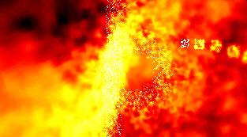



## Demo 1 \- Incredibly Fast Graphical Manipulation

### Description

This code is a screensaver, or rather a demo, that shows an example of several graphic techniques and effects including pointers to a bitmap, fading, mathematical lookup tables, palette switching, and simple Gaussian blurring, and in short, very fast graphical manipulation. The effect is very similar to the winamp plugin 'Geiss' and perhaps others. The code seems to be optimized as much as possible, and runs relatively fast on both my Pentium 3 450mhz and my AMD K6-2 450MHz, considering the effect. You can view additional screenshots at http://romnet.yi.org/prog/demo1/demo1.htm. The palettes are stored in external bitmaps that can be altered for your viewing pleasure. There are two executables in the zip, one runs in a small window and one runs fullscreen at 320x200 using DirectX to change the resolution. (People have been having problems with this- do NOT forget to reference the directdraw type library or you will get an error on Public dd)
 
### More Info
 

             |
---                |---
**Submitted On**   |2000-04-25 17:19:52
**By**             |[Rom](https://github.com/Planet-Source-Code/PSCIndex/blob/master/ByAuthor/rom.md)
**Level**          |Intermediate
**User Rating**    |4.5 (36 globes from 8 users)
**Compatibility**  |VB 5\.0, VB 6\.0
**Category**       |[DirectX](https://github.com/Planet-Source-Code/PSCIndex/blob/master/ByCategory/directx__1-44.md)
**World**          |[Visual Basic](https://github.com/Planet-Source-Code/PSCIndex/blob/master/ByWorld/visual-basic.md)
**Archive File**   |[CODE\_UPLOAD66876122000\.zip](https://github.com/Planet-Source-Code/rom-demo-1-incredibly-fast-graphical-manipulation__1-8845/archive/master.zip)

